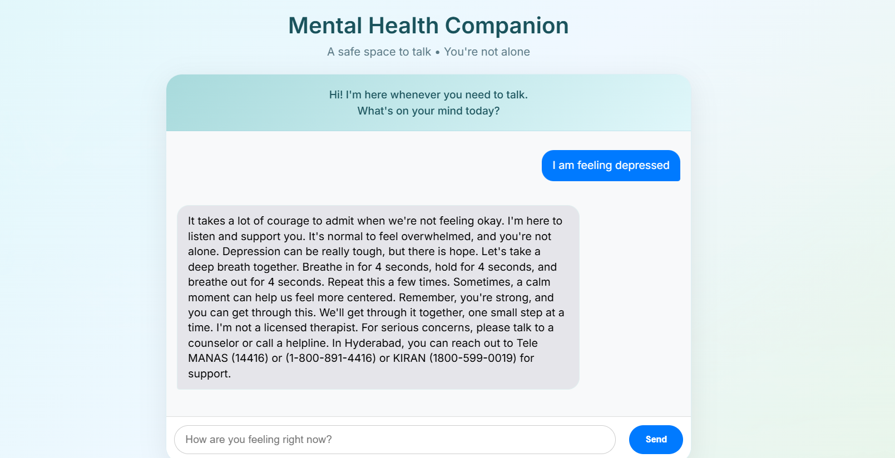

# Mental Health Companion Chatbot

A supportive, anonymous AI chatbot designed to help students manage stress, anxiety, and loneliness.  
Built as a capstone project — uses **free** APIs only (Groq + Llama 3.1).

  
*(Add your own screenshot here later)*

## Features
- Real-time empathetic conversation
- Mood detection (positive/negative/neutral)
- Relaxation technique suggestions (breathing, grounding)
- Crisis keyword detection + India-specific helpline recommendations
- Calming, modern UI with typing indicator
- 100% free – no OpenAI/Hugging Face paid credits needed

## Tech Stack
- **Frontend**: React.js, CSS (calming design)
- **Backend**: Node.js + Express.js
- **AI**: Groq API (Llama 3.1 8B Instant – free tier)
- **Other**: Axios, CORS

## Local Setup (How to Run)

### Prerequisites
- Node.js ≥ 18
- npm
- Groq API key (free): https://console.groq.com/keys

### Steps
1. Clone the repository
   ```bash
   git clone https://github.com/Moinuddinkhan8180/mental-health-companion-chatbot.git
   cd mental-health-companion-chatbot
